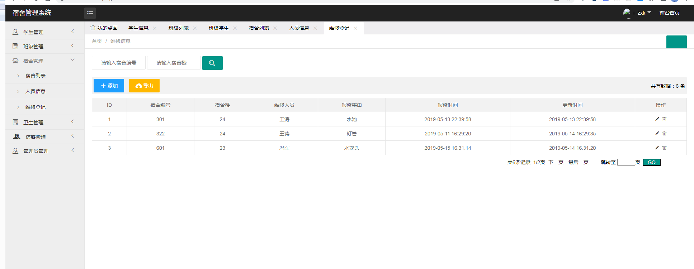

# 宿舍管理系统+SSM+Layui框架

#### 介绍
可作为毕业设计使用
登录使用MD5加密
服务端使用+SSM框架
前端使用Layui框架
数据库使用mysql

实现功能

 管理员的登录与登出
 管理员,班级,学生,宿舍，卫生，访客各模块增删改查
 个别模块关联查询
 各个模块数据导出Excel
 等等一下有演示图片

#### 演示图
演示图

### 需要代码的可以加我的QQ：873015763
可以交付代码以及远程安装运行成功